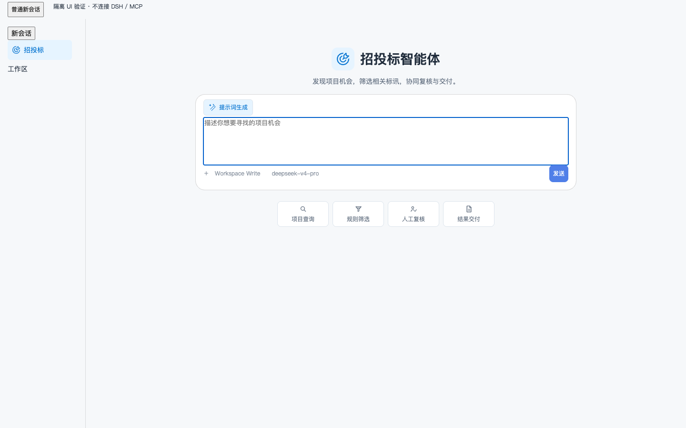
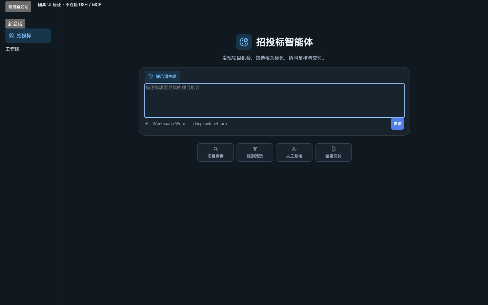

# dsh-tender-workbench

Tender search and bid intelligence in DeepSeek Harness with proposed project search, rule screening, human review and Excel/PDF exports using user-authorized Qichacha MCP.

Install a pinned release using the command in the [Chinese quick start](README.md), review the preview or evidence before confirming, and keep the previous version and task-directory backup for rollback. Qichacha calls use the customer's authorized account.

Related agents: [数据清洗补全](https://github.com/duhu2000/dsh-data-cleaning-agent) · [AI填表](https://github.com/duhu2000/dsh-form-fill-agent) · [访前尽调](https://github.com/duhu2000/dsh-pre-duediligence) · [招投标](https://github.com/duhu2000/dsh-tender-workbench)

[中文](README.md) | **English**

`dsh-tender-workbench` is an open-source DeepSeek Harness plugin for finding, screening, reviewing, and delivering tender opportunities. It combines authorized `qcc-tender` data, deterministic screening rules, bounded Agent analysis, explicit human decisions, and immutable Excel/PDF reports in one Session-scoped Better Sidebar workbench.

Current stable version: **0.5.5** (stable release).

This release targets the full DSH 0.1.2-rc.1 distribution with Better Sidebar 0.18.1; legacy hosts are no longer supported. Back up the complete Profile and verify dependencies before upgrading; do not overwrite a working local hotfix or an unverified host combination.

## What it does

The workbench follows four business phases:

1. **Find opportunities**: search tender notices and proposed projects with source, keyword, date, region, stage, procurement, industry, type, amount, approval, and investment conditions supported by the connected data source.
2. **Screen candidates**: edit Agent-proposed criteria, run deterministic impact previews, confirm a rule set, and inspect five mutually exclusive outcomes: included, observed, manual review, rule excluded, and unmatched.
3. **Human confirmation**: review pending and completed records separately, prioritize Agent recommendations, make individual or batch decisions, retain notes, and undo the latest review operation.
4. **Deliver**: confirm the reviewed scope and generate Excel and PDF files from one immutable report snapshot. Partial delivery remains explicit when records are still pending.

Agent analysis covers every record classified as included, observed, or requiring manual review. Rule-excluded and unmatched records are not analyzed. Analysis runs in deterministic batches until the eligible set is complete, and interrupted work resumes from the remaining records.

The human-review queue keeps Agent recommendations separate from user decisions. Its default ordering is priority review, watch, not recommended, then unanalyzed. Classification lists are ordered included, observed, manual review, rule excluded, then unmatched before pagination.

## Architecture

The package is a Host + Client DeepSeek Harness plugin:

- The Client registers one Session-targeted Better Sidebar tab and public launcher actions. It builds typed, user-visible intents and consumes bounded Session projections and Artifact APIs.
- The Host validates intents, calls the exact authorized MCP tools, owns workflow state transitions, stores Session-private Artifacts, and renders reports.
- Persistent business state is reconstructed from typed conversation events and immutable Artifact references. The UI does not infer state from model text or maintain a second cross-Session state machine.
- Query, criteria, analysis, review, and report writes share a Session-scoped single-flight guard. Read-only browsing remains available while a write is running.
- Registrations, subscriptions, portals, routes, and other side effects are tied to the plugin Context lifecycle and are disposed on unload or hot reload.

The plugin uses public DeepSeek Harness services and the public `dsh-better-sidebar` contract. It does not modify Harness source, access Provider internals, fetch MCP from the browser, read connector storage, hold API credentials, or write internal data to the Workspace.

## Data and report boundaries

Each Session has one active normalized dataset. A successful new query atomically replaces that active snapshot instead of merging results; historical Artifacts remain available for traceability while downstream state from the old snapshot becomes inactive.

Schema-valid MCP fields are retained as source facts. Missing values, disclosed-but-unparseable values, source failures, rule exclusions, and user exclusions remain distinct states and are not inferred from one another.

Excel is organized for analysis and verification, with separate overview, distribution, source-specific result, review, traceability, and data-quality sheets. PDF is organized for business readers, leading with deterministic conclusions, result distributions, deadline windows, and a bounded set of records requiring near-term verification. Both formats use the same immutable report snapshot; a failed format can be retried without re-querying or changing successful files.

## Requirements and compatibility

This release constrains core peers to `~0.1.2-rc.1`; future combinations require verification:

- DeepSeek Harness public packages: `0.1.2-rc.1`
- `dsh-mcp-connector`: `0.2.31`
- `dsh-better-sidebar`: `0.18.1`

The active Profile must provide one coherent runtime with public Session Projection, JSONL Session Persistence, Tools, Skill, Sessions, and WebServer services. Better Sidebar must expose the public `targetedOpen` and `stateSubscription` features.

Before installing, run `node scripts/check-host-compatibility.mjs --host-root /actual/node_modules/@deepseek-ai/dsh --profile-root /actual/profiles/web`. It only reads package manifests: known incompatible hosts, mixed core packages and old Sidebar fail; unknown combinations are reported as unverified. The Windows mount script requires `-DshHostRoot` and executes this gate before mutation. Upgrade the complete host explicitly after backing up the Profile: `npm install -g @deepseek-ai/dsh@0.1.2-rc.1`.

Context is not required. If already installed, 0.36.0 has a known removed settingsNamespace dependency; the coexistence baseline is 0.48.0. Update only with user approval and a backup. Rollback requires a complete verified host/plugin combination: do not install the original 0.5.4 or older package alone on the new host. Startup smoke does not prove live QCC or four-product acceptance.

An installed and authorized `qcc-tender` MCP connection must expose these exact tools:

- `mcp__qcc-tender__search_tenders`
- `mcp__qcc-tender__search_proposed_projects`

Without a compatible Better Sidebar provider, conversation entry points and supported Host tools remain available; shortcuts show actionable install/upgrade, enable-tab and restart guidance. No private sidebar is created. Other missing required services, unavailable MCP tools and non-JSONL persistence fail explicitly, with no Web-search or alternate-storage fallback.

## Install

Install the current stable release and its required Provider plugins:

```sh
dsh plugin --profile web add 'dsh-mcp-connector@>=0.2.31'
dsh plugin --profile web add 'dsh-better-sidebar@0.18.1'
dsh plugin --profile web add dsh-tender-workbench
dsh web --no-open
```

To install the exact 0.5.5 release:

```sh
dsh plugin --profile web add 'dsh-mcp-connector@>=0.2.31'
dsh plugin --profile web add 'dsh-better-sidebar@0.18.1'
dsh plugin --profile web add dsh-tender-workbench@0.5.5
```

To install from an independent checkout, install the required Provider plugins first, then run from this repository:

```sh
corepack pnpm@11.7.0 install --frozen-lockfile
corepack pnpm@11.7.0 run build
dsh plugin --profile web add 'dsh-mcp-connector@>=0.2.31'
dsh plugin --profile web add 'dsh-better-sidebar@0.18.1'
dsh plugin --profile web add .
dsh web --no-open
```

To install a packed build:

```sh
dsh plugin --profile web add 'dsh-mcp-connector@>=0.2.31'
dsh plugin --profile web add 'dsh-better-sidebar@0.18.1'
dsh plugin --profile web add ./dsh-tender-workbench-0.5.2.tgz
dsh web --no-open
```

The package's `dsh.bundle.patch` declaration activates `cordis.patch.yml`, which contributes the `dsh-tender-workbench` Loader row. Restart the Web profile after adding or removing the plugin.

To remove it:

```sh
dsh plugin --profile web remove dsh-tender-workbench
```

## Upgrade and rollback

Upgrade an existing installation by installing the stable version and fully restarting the Web profile:

```sh
dsh plugin --profile web add dsh-tender-workbench@0.5.5
dsh web --no-open
```

Version 0.5.5 retains the v1.5.0 singleton Tab, five navigation shortcuts and Client-lifetime draft recovery while migrating the client modules and services to the new host. Business schemas are unchanged; history remains Session-local and live MCP connectivity is not verified. Restore a backed-up, fully verified host/plugin combination for rollback, not the original 0.5.4 or an older package alone on the new host.

## Using the workbench

The top-left “招投标” launcher creates a distinct native Session using the current, recent, or first available workspace path. It shows the “招投标智能体” title and goal icon without opening the workbench. Below-composer shortcuts explicitly open the query, screening, review, or delivery view; the Session Header recovery action remains available. Other Sessions retain their original branding.

## Interface examples and marketplace submission

These screenshots show the actual 0.5.2 React components in an isolated host fixture, visibly labeled as isolated UI validation without DSH/MCP connections. They contain no customer information or real business responses. They do not demonstrate live DSH/QCC operation or marketplace one-click installation.




See [submission status and isolated install/uninstall evidence](docs/MARKET-SUBMISSION.md). An open PR is not a completed marketplace listing.

Navigation only changes the visible workbench phase. It does not mutate business state or run a later action. Criteria are proposed, edited, previewed, and confirmed as distinct steps. Agent recommendations never become user decisions automatically. Report generation always shows the reviewed and pending scope before creating a delivery snapshot.

The layout is container-responsive: wide workspaces use master/detail grids, while medium and narrow workspaces preserve the same information order with local table scrolling and reachable fixed actions.

## Development

Use the Node.js and pnpm versions declared by the repository:

```sh
corepack pnpm@11.7.0 install --frozen-lockfile
corepack pnpm@11.7.0 run check
```

The build emits the Host loader at `lib/index.js`, the Client bundle at `lib/client.js`, and declarations under `lib/types/`.

`check` runs type checking, the full Vitest suite, the production build, README/release-state validation, and an npm tarball whitelist preview. Release tags are published by [the release workflow](.github/workflows/release.yml) through npm Trusted Publishing with provenance when Trusted Publishing is configured; manual npm publication must not claim provenance. The repository must never contain npm tokens, GitHub tokens, QCC credentials, source datasets, or Session-private Artifacts.

The province, city, and district source snapshot is maintained in [resources/area.ts](resources/area.ts).

See [CHANGELOG.md](CHANGELOG.md) and [the 0.5.2 release checklist](docs/RELEASE-0.5.2.md) for the stable-release scope and operational checks.

## Current scope

The plugin does not provide online PDF preview, delivery-version comparison, regeneration of already successful files, subscriptions, CRM follow-up, enterprise profiles, source-accuracy verification, or Bid/No-Bid decisions. Query, classification, analysis, and review are all valid stopping points; later actions only run after explicit user input.
